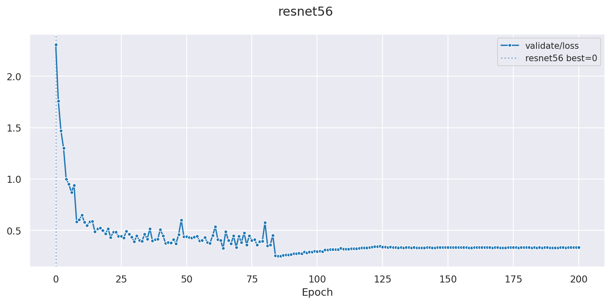

# CIFAR-10 — reproducing He et al. (2016)

`train_cifar_resnet56.py` replicates the CIFAR-10 result reported in
*Deep Residual Learning for Image Recognition* (He et al., 2016):
**6.97 % test error (~93 % accuracy)** with ResNet-56.

It demonstrates extending `mentor` with a **custom trainer** that deviates
from the built-in Adam + StepLR defaults.

---

## Architecture

ResNet-56 is a CIFAR-specific design — it is not the same as the ImageNet
ResNet-50 or ResNet-101 variants:

- 3x3 convolutions throughout, no max-pool stem
- Three groups of 9 `BasicBlock` residual blocks (16 -> 32 -> 64 filters)
- Global average pooling before a 10-class linear head
- **855 K parameters** — fits comfortably in under 1 GB of GPU memory

The paper trained on two GPUs with a combined batch size of 128.  With
modern hardware a single GPU is sufficient.

## Training recipe

The script matches the paper's optimisation settings exactly:

| Hyperparameter | Value |
|---|---|
| Optimiser | SGD, momentum 0.9, weight decay 1e-4 |
| Initial LR | 0.1 |
| LR schedule | /10 at 32 K, 48 K, and 64 K iterations |
| Batch size | 128 |
| Epochs | 200 (~78 K iterations) |
| Augmentation | random crop 32x32 with padding 4, random horizontal flip |

## Performance and runtime

Measured on an RTX 3090:

- **Throughput:** ~43 iterations / sec
- **Total runtime:** ~30 minutes (78 K iterations / 43 it/s ~= 1 814 s)
- **Peak GPU memory:** < 1 GB
- **Best validation accuracy:** ~93.02 % (test error ~6.98 %)

### Loss curve



The three-step staircase is the SGD schedule in action: loss drops sharply at
epoch ~82 (32 K iterations), again at ~123 (48 K), and once more at ~164
(64 K), exactly matching the paper.

Reproduce the plot from a finished checkpoint with:

```bash
mtr_plot_file_hist -paths ./tmp/resnet56.pt -verbose \
    -values validate/loss -output /tmp/cifar_56_loss.png
```

## Usage

```bash
# fresh run
python train_cifar_resnet56.py

# resume from a checkpoint, show progress bars
python train_cifar_resnet56.py -resume_path ./tmp/resnet56.pt -epochs 200 -verbose

# change device or batch size
python train_cifar_resnet56.py -device cuda:1 -batch_size 256
```

All parameters have defaults; run with `-h` for the full list.

## What the custom trainer demonstrates

`CifarSGDResnetClassifier` is a `MentorTrainer` subclass that illustrates
two common reasons to write a custom trainer instead of using `Classifier`:

**1. A different optimiser — SGD instead of Adam**

The built-in trainers use Adam.  `CifarSGDResnetClassifier.create_train_objects`
creates an SGD optimiser with momentum and weight decay:

```python
self._optimizer = torch.optim.SGD(
    model.parameters(), lr=lr, momentum=0.9, weight_decay=1e-4
)
```

Assigning `self.trainer = CifarSGDResnetClassifier()` in the model's
`__init__` is sufficient — `Mentee` delegates `create_train_objects`,
`training_step`, and `validation_step` to the trainer automatically.

**2. An iteration-based LR schedule instead of an epoch-based one**

The paper's schedule fires at fixed iteration counts (32 K / 48 K / 64 K),
not at fixed epoch boundaries.  `IterationMultiStepLR` is a lightweight
scheduler that reads `mentee.total_train_iterations` — a counter maintained
and checkpointed by `Mentee` — instead of carrying its own state:

```python
class IterationMultiStepLR:
    def _apply_lr(self):
        done = self.mentee.total_train_iterations   # restored on resume
        factor = self.gamma ** sum(1 for m in self.milestones if done >= m)
        for pg in self.optimizer.param_groups:
            pg["lr"] = self.base_lr * factor

    def step(self):          self._apply_lr()
    def state_dict(self):    return {}           # no extra state to save
    def load_state_dict(self, _): self._apply_lr()
```

Because `total_train_iterations` is persisted in the checkpoint, the
LR is automatically restored to the correct value on resume — even when
continuing on a different machine or with a different batch size.
